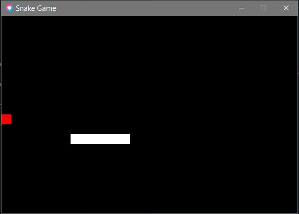

#Snake Game in Love2D

## Overview
This project is a simple implementation of the classic Snake game using the Love2D framework. The game features a snake that moves around a grid, collects food to grow longer, and ends when it collides with itself or the screen boundaries.

## How to run
- make sure you have love2d installed
- download the readme files
- open the main.lua file with a editor
- run the file

